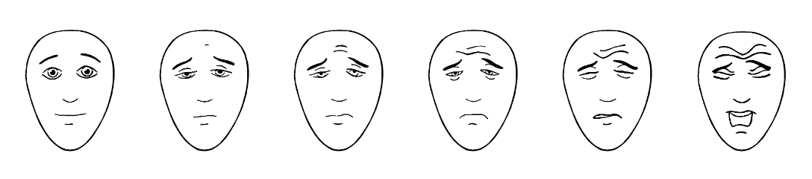

# What is pain?

* Work in groups (5 min)
* Provide a definition of pain
* Think about physiology and psychology

---

# International Association for the Study of Pain

<https://www.iasp-pain.org>

---

# Pain

_An unpleasant sensory and emotional experience associated with actual or potential tissue damage, or described in terms of such damage_

IASP

---

# Pain

* If the patient is unable to communicate pain **it doesn't mean that she/he is not in pain and require treatment**
* Pain is always subjective
* Pain always has two components:
	- sensory (_my leg hurts_)
	- emotional (_I suffer because of leg pain_)

---

# Pain

* Pain is often connected with tissue damage **but not always**
* Often pain has no underlying patophysiological cause 
* **Pain is in the brain**

---

# Pain

* If the patient reports pain, it means that the patients is in pain (in most cases)
* _Activity induced in the nociceptor and nociceptive pathways by a noxious stimulus is not pain, which is always a psychological state, even though we may well appreciate that pain most often has a proximate physical cause._ (IASP)

---

# What is pain for?

* Work in groups (5 min)
* Think of as many functions of pain as you can

---

# Functions of pain

* **Flight** - instantaneous avoidance of painful stimuli
* **Healing** - pain promotes faster healing (in most cases)

---

# Functions of pain

* **Motivation** - people learn by associative learning to avoid painful stimuli 
* Pain is **crucial to survival** (patients with congenital insensitivity to pain have shorter life expectancy)

---

# Three types of pain (IASP Taxonomy)

* Nociceptive 
* Neuropathic 
* Nociplastic

---

# Nociceptive pain

Pain that arises from actual or threatened damage to non-neural tissue and is due to the activation of nociceptors.

---

# Nociceptive pain

* This term is designed to contrast with neuropathic pain. 
* The term is used to describe pain occurring with a normally functioning somatosensory nervous system to contrast with the abnormal function seen in neuropathic pain.

---

# Neuropathic pain

Pain caused by a lesion or disease of the somatosensory nervous system.

---

# Neuropathic pain

* Examples: diabetic neuropathy, phantom pain
* Neuropathic pain is a clinical description (and not a diagnosis) which requires a demonstrable lesion or a disease that satisfies established neurological diagnostic criteria. 

---

# Neuropathic pain

* Somatosensory refers to information about the body _per se_ including visceral organs, rather than information about the external world (e.g., vision, hearing, or olfaction). 

---

# Neuropathic pain

* The term lesion is commonly used when diagnostic investigations (e.g. imaging, neurophysiology, biopsies, lab tests) reveal an abnormality or when there was obvious trauma. 
* The term disease is commonly used when the underlying cause of the lesion is known (e.g. stroke, vasculitis, diabetes mellitus, genetic abnormality). 

---

# Nociplastic pain

* Pain that arises from altered nociception despite no clear evidence of actual or threatened tissue damage causing the activation of peripheral nociceptors or evidence for disease or lesion of the somatosensory system causing the pain.

---

# Nociplastic pain

* Examples: low back pain, fibromyalgia, complex regional pain syndrome
* Patients can have a combination of nociceptive and nociplastic pain

---

# Chronic vs. acute pain

* Chronic pain is pain lasting longer than 1/3/6 months
* Chronic pain is pain lasting longer than the expected period of recovery
* Chronic pain is a disease in itself

---

# Other definitions

---

# Allodynia

Pain due to a stimulus that does not normally provoke pain.

---

# Allodynia

* The stimulus leads to an unexpectedly painful response. This is a clinical term that does not imply a mechanism. 
* Allodynia may be seen after different types of somatosensory stimuli applied to many different tissues.

---

# Allodynia

* The term allodynia was originally introduced to separate from hyperalgesia, the condition seen in patients with lesions of the nervous system where touch, light pressure, or moderate cold or warmth evoke pain when applied to apparently normal skin. 
* It is important to recognize that allodynia involves a change in the quality of a sensation, whether tactile, thermal, or of any other sort. The original modality is normally nonpainful, but the response is painful. 

---

# Analgesia

* Absence of pain in response to stimulation which would normally be painful.
* Not the same as _anesthesia_ - state of controlled, temporary loss of sensation or awareness that is induced for medical purposes

---

# Hyperalgesia

* Increased pain from a stimulus that normally provokes pain.

---

# Pain threshold

* The minimum intensity of a stimulus that is perceived as painful.

---

# Pain tolerance level

* The maximum intensity of a pain-producing stimulus that a subject is willing to accept in a given situation.

---

# Placebo

* A substance or treatment which is designed to have no therapeutic value but provides **analgesia**

---

# Nocebo

* A substance or treatment which is designed to have no therapeutic value but provides **hyperalgesia**

---

# Evaluating pain

---

# VAS (Visual Analog Scale)

---

# NRS (Numerical Rating Scale)

---

# FACES

---

# FACES

---

# FLACC observational scale

* Face
* Legs
* Arms
* Cry
* Consolability
* (Children’s Hospital of Eastern Ontario Pain Scale)

---

# BPI

---

# Experimental pain

---

# Experimental pain

* One way to study pain is to make experiments
* This can help establish **causality**
* Need to consider ethical guidelines

---

# Experimental pain 

* Cold pressor task 
* I.e. 3°C water for a max of 2 minutes

---

# Evaluation

* Pain threshold (sec)
* Pain tolerance (sec)
* Average pain intensity (NRS)
* Maximal pain intensity (NRS)

---

# Water bath

---

# Other experimental stimuli

* Heat pain (thermodes)
* Electrical shocks

