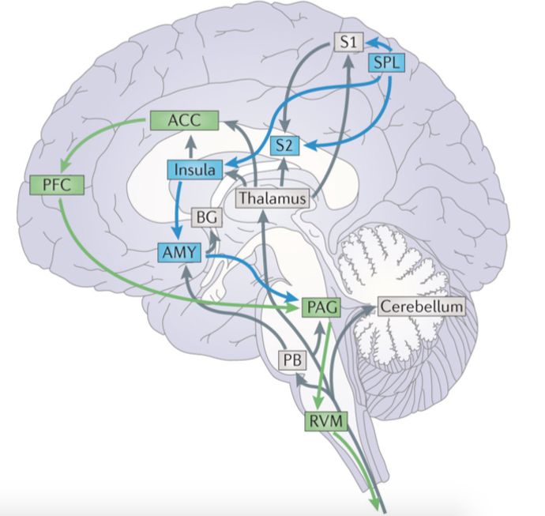
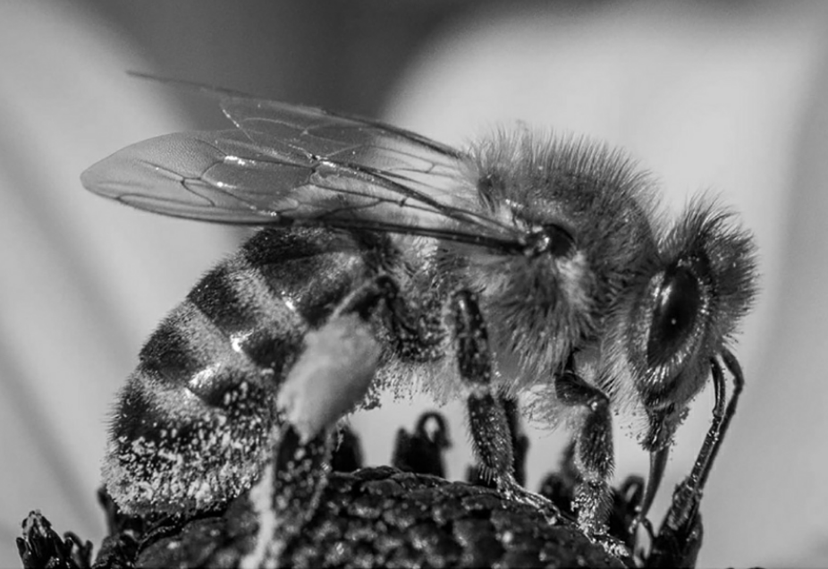
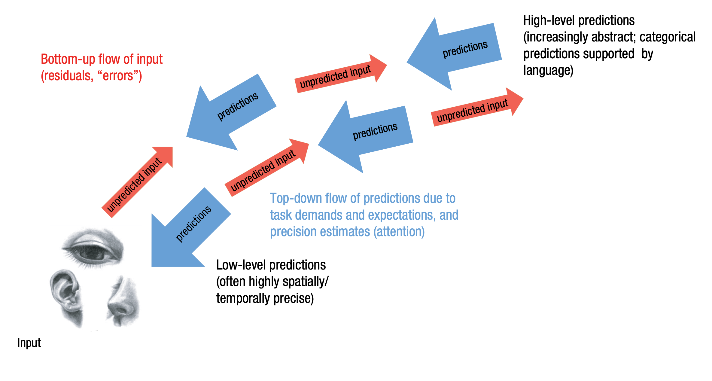

# Neuroscience of pain

---

# Nociception

*  Activation of pain receptors (nociceptors)
*  Activation of pain pathways
*  A specific pattern of nociception leads to the sensation of pain

---

# Nociception

*  Nociceptors - receptors in skin, muscles, joints etc.
*  Two types of fibers carry information from nociceptors:
    * Aδ - myelinated - rapid transmission
    * C - not myelinated - slower transmission (_second pain_)
*  These end in the dorsal horn

---

# Nociceptors

*  Some nociceptors respond to specific type of stimulation, eg. heat, pressure, chemical burns.
*  Nociceptors differ in terms of activation threshold - some "quiet" receptors need more stimulation than others

---

# Nociceptors

*  Sensitization (not habituation) of C fibers due to prolonged stimulation
*  If stimulation is long enough, more distant nociceptors become active
*  Nociception may last longer than pain stimulation itself

---

# Gate control theory (Melzack, Wall)

---

# Gate control theory (Melzack, Wall)

---

# Gate control theory (Melzack, Wall)

*  Extentions of gate control theory state that the gate might be regulated centrally
*  Unclear mechanism but some cognitive processes are implicated

---

# Pain pathway

---

# Brain regions _involved_ in pain processing

* Cerebellum (Cb)
* Thalamus (Thal)
* Insula (Ins)
* Anterior cingulate cortex (ACC)
* Primary somatosensory cortex (SI)
* Secondary somatosensory cortex (SII)
* Supplementary motor area (SMA)

---

# Pain modulation

* Pain modulation - change in pain (analgesia or hyperalgesia) as a result of other processes, also cognitive
* Descending Pain Modulation System (DPMS)
* Periaqueductial grey matter (PAG)
* Slightly different emotional and cognitive traces of modulation

---

# Pain modulation

---

# Emotional / affective modulation

* Positive affect **decreses pain**
* Negative affect **increses pain**
* ...but not always (stress-induced analgesia)
* Limbic system involved (yeah...)
* Pain vs. depression conundrum

---

# Cognitive modulation

* Concentrating on pain **increases** pain
* Distraction **decreases** pain
* Placebo effect
* Nocebo effect

---

# Predictive processing (PP)

---

# PP

* Predictive processing
* Predictive coding 
* Active inference

---

# Herman von Helmholtz (1821 - 1894)

---

# Karl Friston

---

# PP

Perception is a combination of:

* **Predictions** based on prior knowledge
* Sensory data confirming/denying these predictions

---

# PP

Perception is a combination of:

* top-down processes
* bottom-up processes

---

# Perception is controlled hallucination

* We use (bayesian) probabilistic inference, to construct a **generative model of the world**
* This model is used to **construct** perception

---

# The brain is a prediction machine

* The brain (or the entire CNS) is a multilayered, hierarchical device that non-stop **predicts its own sensory states** (exteroceptive, interoceptive, proprioceptive)
* **Hierarchical** because **higher** structures predict the states of lower structures

---

# Prediction errors

* If sensory states confirm the predictions, everything is fine
* If not, **prediction errors** are propagated upstream to change the generative model
* This is **learning**

---

# Precision

* _Self-estimated sensory uncertainty_
* Prediction errors can have higher or lower precision
* Example: our vision is worse at night = less certainty in the visual system = higher information entropy = less precision
* **The lower the precision, the lower the chance that prediction errors will update the generative model**

---

# Precision is attention

* Under PP, precision is attention
* If you direct attention at smth, you try to increase prediction error precision
* Increasing precision leads to increased chance of changing the generative model

---

# Real-life examples

200 km/h!

---

---

---

---

<https://michaelbach.de/ot/mot-flashLag/index.html>

---

---

# PP is not only perception

- **Active inference** is a similar concept applied to **action**
- **Free energy principle** is a formal statement that explains how living and non-living systems remain in non-equilibrium steady-states by restricting themselves to a limited number of states (Wikipedia)
- It is the generalization of PP

---

# If you're interested

---

# If you're interested

- [Anil Seth: Your brain hallucinates your conscious reality](https://www.youtube.com/watch?v=lyu7v7nWzfo)
- [Andy Clark: Happily Entangled: Emotions Cognition and the Predictive Mind](https://www.youtube.com/watch?v=OS3RM3F8YmE)