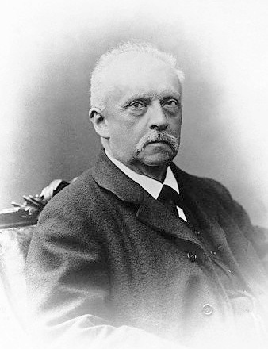
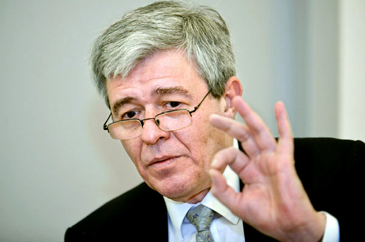

# Predictive processing

Krzysztof Basiński

---

# Predictive processing (PP)

* Bayesian brain hypothesis
* Predictive coding 
* Active inference
* Free energy principle

---

# Herman von Helmholtz (1821 - 1894)

---

# Karl Friston

---

# PP

Perception is:

* **Predictions** based on prior experience (knowledge, bayesian priors)
* Sensory data 
- Danych sensorycznych potwierdzających (lub nie) te predykcje

---

# PP - o co chodzi?

Percepcja jest kombinacją:

- procesów **zstępujących** (top-down)
- procesów **wstępujących** (bottom-up)

---

# Percepcja to kontrolowana halucynacja

- Wykorzystujemy probabilistyczną wiedzę, żeby tworzyć **generatywny model świata**
- Model ten wykorzystujemy do **konstruowania** doświadczeń percepcyjnych

---

# Mózg jako maszyna do tworzenia predykcji

- Mózg (UN) to wielowarstwowe, wieloośrodkowe, hierarchiczne urządzenie, które non-stop zajmuje się **przewidywaniem własnych stanów sensorycznych** (eksterocepcji, interocepcji, propriocepcji)
- **Hierarchiczne**, ponieważ _wyższe_ struktury cały czas starają się przewidzieć stany _niższych_ struktur

---

# Błędy predykcji (prediction errors)

- Jeśli stany sensoryczne zgodne są z modelem/przewidywaniami: wszystko jest ok
- Jeśli nie: powstają błędy predykcji, które uaktualniają model tak, by lepiej przewidywał stany
- To jest **uczenie się**

---

# Precyzja

- _Self-estimated sensory uncertainty - precision_
- Błędy predykcji mogą wynikać z różnych przyczyn
- W nocy widzimy mniej niż w dzień
- Mózg zdaje sobie sprawę z niepewności związanej z błędami predykcji
- Im większa niepewność/mniejsza precyzja, tym błędy mają mniejszą szansę wpłynąć na model generatywny

---

# Precyzja a uwaga

- W PP ten mechanizm utożsamiany jest z **uwagą**
- Jeśli kierujemy na coś uwagę, zwiększamy precyzję błędów predykcji
- Zwiększając precyzję, zwiększamy szansę na zmianę modelu świata

---

# PP to nie tylko percepcja

- PP sugeruje, że tworzenie modeli jest naczelną zasadą organizującą systemy biologiczne!
- W tym sensie aplikowane jest do wszystkich obszarów funkcjonowania umysłu

---

# PP to nie tylko teoria! 

- PP to zasada, wg. której skonstruowane są układy nerwowe!
- Mózgi ssaków mają architekturę, która pozwala na PP (mają?)

---

# Predykcje w życiu

200km/h!

---

# Proste przykłady

---

# Proste przykłady

<https://michaelbach.de/ot/mot-flashLag/index.html>

---

# Od PP do free energy principle

---

# Problemy z PP

- Teoria wszystkiego?
- Falsyfikowalność?
- Czy PP to wszystko, czy jest coś jeszcze?
- Czy PP tłumaczy celowość, moralność, inne ludzkie przywary?
- Czy free energy principle się zgadza?

---

# Jeśli kogoś to zainteresowało...

[Anil Seth: Your brain hallucinates your conscious reality](https://www.youtube.com/watch?v=lyu7v7nWzfo)

[Andy Clark: Happily Entangled: Emotions Cognition and the Predictive Mind](https://www.youtube.com/watch?v=OS3RM3F8YmE)

---

# Książki o PP

Jakob Hohwy, The Predictive Mind (2014), Oxford University Press

---

# Książki o PP

