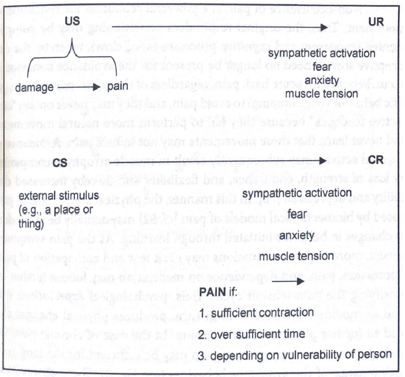

---

# Chronic pain

---

# Psychogenic pain?

*  Often pain is present without obvious pathology
*  This leads to various "psychogenic" explanations of pain

---

# Psychogenic pain?

*  Different therapies often produce similar effects
*  I.e. fibromyalgia - about 50 different pharmacological therapies (from opioids to growth hormone injections) and 50 non-pharmacological therapies (ie. balneotherapy) have been proven effective in reducing pain in this condition

---

# Psychological models of chronic pain

*  Pain prone personality
*  Motivational approach
*  Habituation, sensitization and learning
*  Fear-avoidance

---

# Pain-prone personality (Blumer & Heilbronn, 1982)

*  A personality type that is more inclined to chronic pain
*  Supposed traits:
    - denial of interpersonal and emotional problems
    - lack of activity
    - depressive mood
    - sense of guilt
    - lack of initiative
    - depression, alcohol dependency and chronic pain in family

---

# Pain-prone personality (Blumer & Heilbronn, 1982)

*  This theory has very weak empirical support
*  Logical basis of this theory has been widely criticized

---

# Pain-prone personality - methodological considerations

*  A lot of "somatic" items in psychological questionnaires 
*  Beck Depression Inventory: _I am worried about physical problems like aches, pains, upset stomach, or
constipation._
*  MMPI for diagnosing personality in chronic pain patients is inappropriate

---

# Motivational approach - malingering and symptom exaggeration

*  This is used by insurance companies
*  If no pathology is diagnosed, the patient:
    - exaggerates
    - malingers

---

# Motivational approach - problems

*  No method to objectively test for pain
*  Methods based on inconsequence are biased
*  No empirical evidence for analgesic properties of recieving insurance money

---

# Habituation and sensitizaton

*  Most people are able to habituate to average intensity pain **in appropriate conditions**
*  In chronic pain patients there is **sensitization** instead of **habituation** 

---

# Classical conditioning

*  Acute pain - **unconditional stimulus**
*  Reaction to acute pain - sympathetic activation, muscle tension, anxiety - **unconditional response**

---

# Classical conditioning

*  **Neutral** stimuli (certain moves, sights, places) are **conditioned** with pain
*  This produces a **conditioned response** - sympathetic activation, muscle tension, anxiety

---

# Pain conditioning

---

# Fear-avoidance model

*  Not only classical conditioning but also other cognitive processes play a role
*  Expectations and beliefs about pain influence our behaviour
*  **Avoidance** - avoiding behaviours associated with pain
*  Avoidance may lead to intensification of pain, stress, depression

---

# Fear-avoidance model

