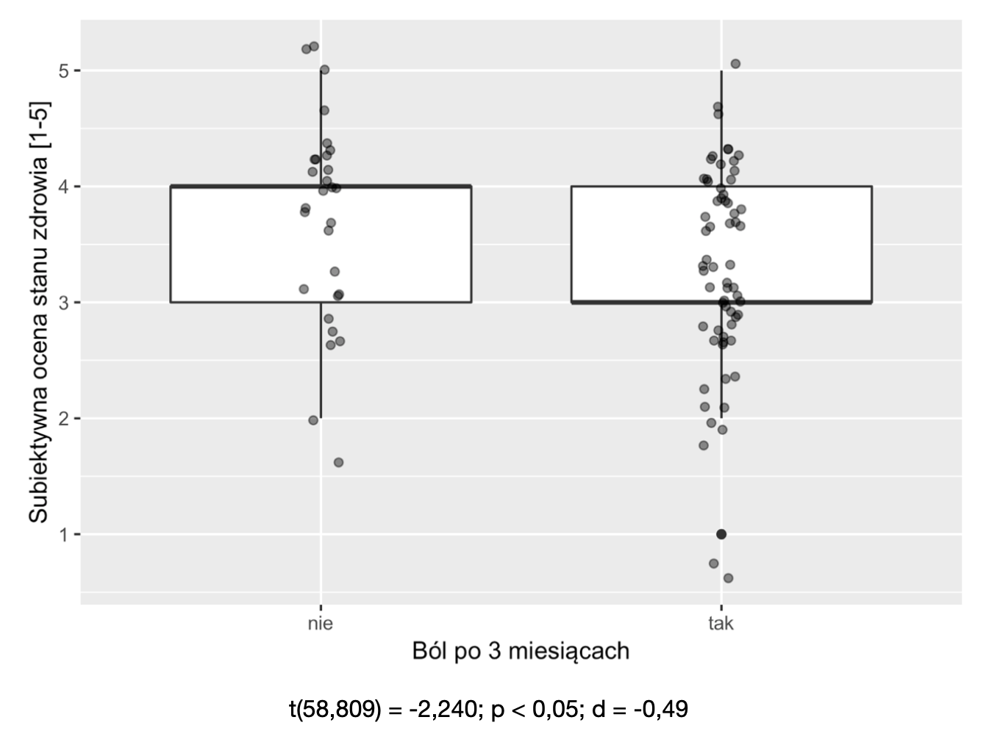
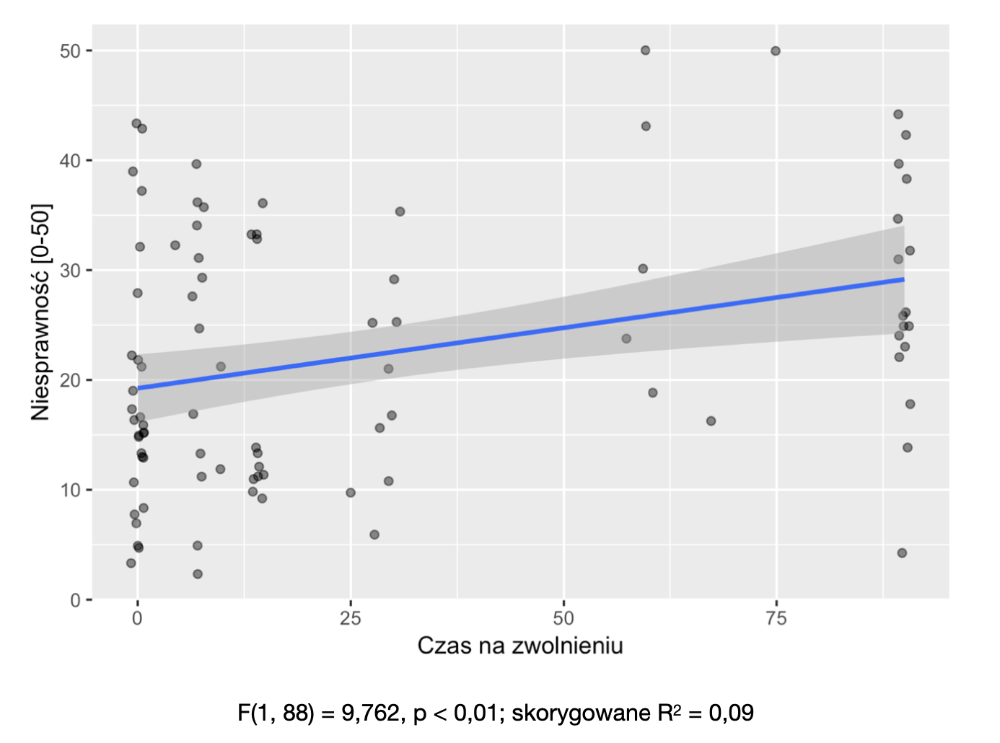
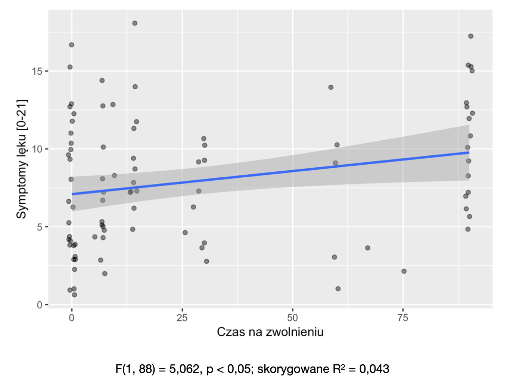
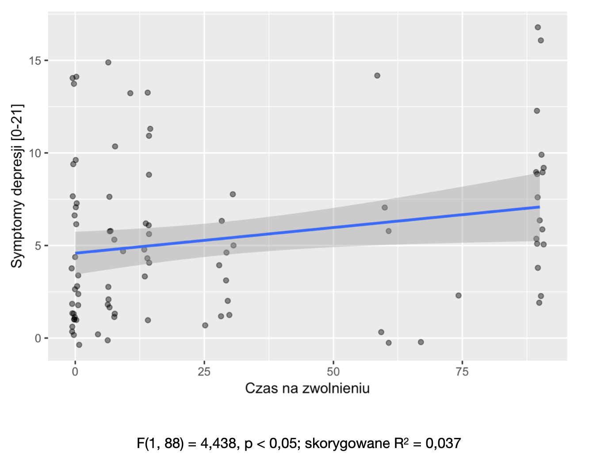
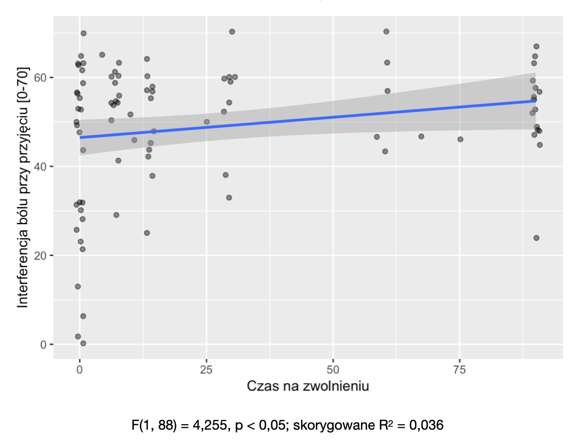

---

# Low back pain

*  Pain in the lumbar area
*  In most episodes of low back pain, an underlying cause is not identified
*  Pain believed to be due to mechanical problems such as muscle or joint strain

---

# Low back pain

*  "Red flags" such as unexplained weight loss, fever, or significant problems with feeling or movement - bone cancer
*  Some low back pain is caused by damaged intervertebral discs, and the straight leg raise test is useful to identify this cause
*  In those with chronic pain, the pain processing system may malfunction, causing large amounts of pain in response to non-serious events

---

# Low back pain

*  Initial management with NSAIDs 
*  Normal activity should be continued as much as the pain allows
*  Medications are recommended for the duration that they are helpful
*  Low back pain often affects mood, which may be improved by counselling or antidepressants.

---

# Low back pain

*  Approximately 9–12% of people (632 million) have LBP at any given point in time
*  Nearly 25% report having it at some point over any one-month period.
*  About 40% of people have LBP at some point in their lives, with estimates as high as 80% among people in the developed world.
*  LBP most often begins between 20 and 40 years of age.
*  Men and women are equally affected.

---

# Low back pain

*  One of the leading causes of disability
*  Highest YLD of all diseases in _Global Burden of Disease_
*  Yearly costs - about 100 billion USD

---

# Chronicity

*  In most cases an acute episode ends after a couple of days
*  In 10%-30% cases chronification
*  Unknown mechanism (functional/structural brain changes, psychological factors)

---

# My study 

---

# Aim

*  To determine the psychosocial predictors of chronification three months after an acute low back pain episode in emergency department patients 
*  To determine the psychosocial predictors of the length of sick leave in these patients

---

# Inclusion criteria

*  Patients of UCK Emergency Department
*  Non-specific LBP
*  Pain-free for at least 3 months before
*  18-65 years
*  Reads and writes in Polish

---

# Exclusion criteria

*  Know or suspected cause of pain (trauma, tumour, infection, rheumatoid arthritis)
*  Pregnancy
*  Other serious illness

---

# Procedure

*  Phase 1 - questionnaire at admission
*  Phase 2 - structured interview via telephone 3 months after admission

---

# Methods

*  Brief Pain Inventory
*  Oswestry Disability Questionnaire
*  Hospital Anxiety and Depression Scale (HADS)
*  Locus of control (MHLC)

---

# Methods - phase 1

*  Coping Strategies Questionnaire (CSQ)
*  Self-rated health (5-point)
*  Socio-demographical questionnaire

---

# Methods - phase 2

*  Structured interview
*  Feeling pain
*  Length of sick leave

---

# Participants

*  N = 110 (49 female)
*  N = 97 (88.1%) in follow-up
*  Age M = 39.34 (SD = 11.07)
*  Mostly university (32.4%) or high school (42.34%) education 
*  Mostly living in urban areas (81.98%), had a steady job (78.38%), non-physical (43.24%)
*  Average BMI = 27.06 (SD = 4.57)

---

# Statistical analysis

*  Welch's t test - differences between means
*  Pearson's r - correlations
*  Multivariate analyses - linear and logistic regression

---

# Results

*  68 patients (70.1%) had pain after 3 months 
*  Average sick leave length - M = 28.26 (SD = 34.40)

---

# Self-rated health

---

# Disability

---

# Anxiety

---

# Depression

---

# Pain interference

---

# Results

*  Lower self-rated health predicted pain chronification 
*  Longer sick leave was predicted by:
	- lower self-rated health
	- higher pain interference
	- internal locus of control
	- turning attention away from pain
	- less frequent re-evaluating pain

